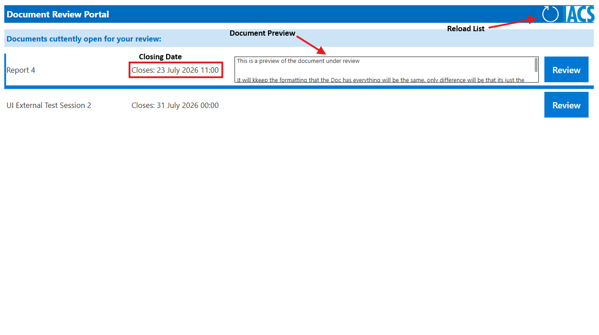
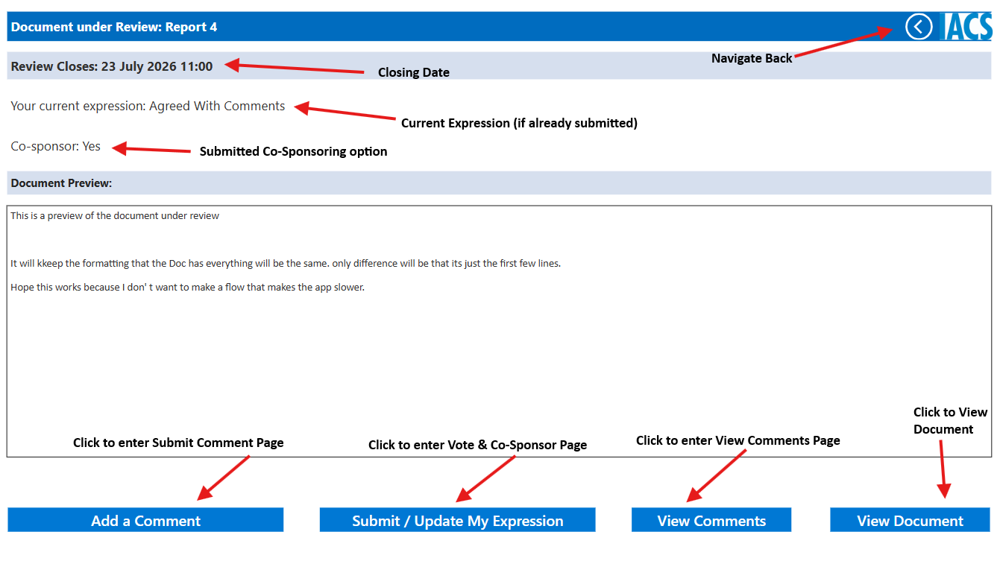

# Draft IACS UI Review Portal

## Overview

The Draft IACS UI Review Portal (the Portal) is a SharePoint page hosting a Microsoft Power Apps application that enables External Reviewers to securely review draft IACS UI documents under discussion, comment on them, submit their Position and choose to Co-Sponsor the IACS UI. Access is not publicly open, and is granted by the IACS Secretariat after a request is submitted via the MS Form **Unified Interpretations (UI) Review Hub Registration Form**. Comments on the Portal must be consolidated, i.e. comments must come from the Flag State Administration, association, NGO, etc. as a body. Individual comments from an organisation's members or staff are not accepted. The External Reviewers are notified when a Review Session is initiated. Each Active Review can be accessed via the Portal until the listed deadline. Upon closure, a report with all the submitted comments and Positions is generated and forwarded to the Internal reviewers team to review and consider the comments. The review process is intended solely as a consultation for the purpose of hearing views, and IACS is not obliged to provide individual responses to all comments received.

## Access

### Requesting Access

To request access, submit the MS Form:

[Unified Interpretations (UI) Review Hub Registration Form – Fill in form](https://forms.cloud.microsoft/e/dN9k7DTQtS)

- The process requires a one-account-per-organisation policy to ensure confidentiality and security.
- Comments on the Portal must be consolidated, i.e. comments must come from the Flag State Administration, association, NGO, etc. as a body.
- Individual comments from an organisation's members or staff will not be accepted.

The <u>required</u> fields in the form are:

1. Full Name: first and last name
2. Organisation
3. Email address: a work (organisation) email address is required

The form also has an optional notes field, *"Any additional notes we should be aware of"*, where you can submit additional information. This information will be reviewed by the IACS Secretariat and will not be visible on the Portal.

Once you have submitted the form, the IACS Secretariat will review your request and inform you of the outcome by email. Access is granted manually by the IACS Secretariat to ensure that the one-reviewer-per-organisation policy is upheld.

### Updating Access per Organisation

Changes to External Reviewer details and access privileges are requested by emailing it@iacs.org.uk.

If you are stepping down as your organisation's External Reviewer, you are required to inform the IACS Secretariat of your withdrawal from the Portal and provide your successor's full name and email address.

The new External Reviewer will be sent an email containing the [Unified Interpretations (UI) Review Hub Registration Form – Fill in form](https://forms.cloud.microsoft/e/dN9k7DTQtS), which must be submitted to gain access.

When leaving, it is up to you to inform the IACS Secretariat if you would like your personal information (name, organisation, email, and notes) deleted from the Portal. If the IACS Secretariat is not instructed to do so, your details may be retained privately in the archive of inactive users.

## [Draft IACS UI Review Portal on SharePoint](https://iacsltd.sharepoint.com/sites/DocumentReviewHub/SitePages/CollabHome.aspx)

The Draft IACS UI Review Portal is an IACS SharePoint page that hosts the Power Apps tool for Unified Interpretation Reviews.

You can <u>only</u> **View** and **Edit** your own Position. All other Positions are confidential and access is restricted.

Comments are rich text formatted and can include attachments. The recommended file type for attachments is PDF.
All comments are **PUBLIC** and visible to all External Reviewers with access to the Portal. Submitted comments and attachments can be updated only by the original author, up until the deadline.

### Requirements

You must have an **active MS Office Suite licence** in order to use the Portal. If your organisation does not provide the required plan, IACS can extend a licence to you for the sole use of the Portal. If you cannot access or use the Portal, please contact it@iacs.org.uk.

### Portal Pages

The Portal consists of the following six pages:

1. Active Reviews
2. Review Home
3. Add a Comment
4. Submit / Update My Position
5. View Comments
6. View Document

!!! note

    - The Portal does not act as a historical archive of past sessions, and it is not within scope to maintain records of past review sessions.
    - You can change and update your Position until the closing date.
    - Comments are public, and all External Reviewers can view all submitted comments and download their attachments.

#### 1. Active Reviews

Active Reviews is the landing page of the Portal.

- It displays all currently active review sessions, or simply all UI documents in the **In-Review** status.
- The session name and closing date are listed for each draft UI.
- A refresh button is available *(as indicated by the arrow)* to reload the list if any sessions are missing.
- Clicking the Review button opens the **Review Home** page of the selected session.

A simple text preview of the Document is available (if provided). This preview is plain text; a more detailed preview is available on the Review Home page.

#### 2. Review Home

The Review Home page is the main access point for all available actions you can perform.

The following information is displayed, in this order:

1. Session Title
2. Closing Date
3. Current Position (if previously submitted)
4. Co-Sponsor Option (if previously submitted)
5. Document Preview (if available)

It consists of five buttons:

1. Navigate Back
2. Submit / Update My Position
3. Add a Comment
4. View Comments
5. View Document

Button 1, Navigate Back, loads the Active Reviews page.
Buttons 2 to 4 load the page corresponding to the selected action, while View Document opens the UI in a new tab in **Read-Only Mode**.

**The document under review should not be editable by default. If the document is editable, please notify it@iacs.org.uk immediately.**

#### 3. Add a Comment

You can only submit new comments via the Add a Comment page.

The page contains a **rich text editor**, allowing various font and style text input. Highlighting, superscript/subscript, hyperlinks, bulleted/numbered lists and other features are available.

**Attachments** can be added to each comment. The recommended file type is PDF; however, any file type is accepted as an attachment.

Attachments without any comment text included are not acceptable. This function is meant to provide an option to attach **supporting material** and not to replace the comment entirely.

Empty or blank submissions are not allowed, and the *"Submit Comment"* button is disabled until text is entered in the required section.

You can open the UI Document under review via the *"View Document"* button at the bottom of the page.

If your comment has been submitted successfully, the following notification will appear.

#### 4. Submit / Update My Position

As detailed in [2. Review Home](#2-review-home), if you have not submitted a Position, the Review Home page will not show a saved Position, as shown in the image below.

There are three options to select from:

1. Agreed
2. Agreed With Comments
3. Rejected With Comments

Co-Sponsoring is available and is recorded along with the Position.

!!! note

    1. *"Agreed With Comments"* is only available if you have previously submitted a comment. If there is no comment under your name, you will be notified that your submitted Position has been changed to *"Agreed"*.
    2. Co-Sponsor is available only when the selected Position is *"Agreed"* or *"Agreed With Comments"*.
    3. Changes to a previously submitted Position, including Co-Sponsoring changes, are made in the same way as the initial submission.

If your Position has been submitted successfully, the following notification will appear.

#### 5. View Comments

This section contains all previously submitted comments from External Reviewers who have access to the Portal.

The landing page contains a list of comments with a short preview. Clicking any comment opens a new window with the full text and attachments.

There is a button *"Expand Comments"* that changes the view from preview to full comment. This allows a quick review of all the submitted comments.

Your own comments have two buttons next to them, allowing for editing and deletion.

While editing, if you update attachments, save them **BEFORE** saving the comment changes.

You can remove attachments completely, replace them or add new ones afterwards in comments you created.

After making changes, press the save icon to store them.

Once the changes are saved, the Attachments window closes automatically and a notification window confirming the changes appears at the top of the window.

#### 6. View Document

You can view the UI under review in read-only mode via the Portal.

Throughout the Portal, you can access the document via the *"View Document"* button, which appears on most pages.

If you cannot access the Word file, please contact:
it@iacs.org.uk

## Help

For any further questions, please contact it@iacs.org.uk.
