# Unified Interpretation (UI) Review Portal

## Overview

The UI Review Portal is a SharePoint page containing a Microsoft Power Apps application that enables external reviewers to securely review UI documents under IACS discussion, comment on it, submit their expression and chose to Co-Sponsor the UI. Access is not publicly open, and is granted by the secretariat after request via submitting MS Form **Unified Interpretations (UI) Review Hub Registration Form**. Comments on the platform must be consolidated i.e. comments must come from the flag, association, NGO etc. as a body. Individual comments from members or staff are not accepted. The External Reviewers are notified when a Review Session is initiated. Each Active Review can be accessed via the App until the listed deadline. Upon closure, a report with all the submitted comments and votes is generated and forwarded to the Internal reviewers team to review and answer to comments. The review process is intended solely as a consultation for the purpose of hearing views, and IACS is not obliged to provide individual responses to all comments received.

## Access

### Requesting Access

Access is requested via the MS Form:

[Unified Interpretations (UI) Review Hub Registration Form – Fill in form](https://forms.cloud.microsoft/e/dN9k7DTQtS)

- The process requires a one reviewer per organization policy to reassure confidentiality and safety.
- Comments on the platform must be consolidated i.e. comments must come from the flag, association, NGO etc. as a body.
- Individual comments from members or staff will not be accepted.

The <u>required</u> fields in the form are:

1. Full Name
    First and Last Name
2. Organisation
3. Email address
    The organization/work email is required.

There is an optional notes field in the form, *"Any additional notes we should be aware of"* that allows additional information to be submitted. This information will be reviewed by the IACS Secretariat and will not be visible in the platform.

After submitting the form the IACS Permanent Secretariat team will review the request and contact via email to inform of admission. Access is granted manually by the IACS Secretariat to monitor and insure the one reviewer per organisation policy is sustained.

### Updating Access per Organisation

Update of reviewer details and change of access privileges is done via email, contacting it@iacs.org.uk.

The existing external reviewer member is required to inform of his withdrawal from the platform and provide the successor's Full name and Email.

An email will be sent to the new External Reviewer containing the [Unified Interpretations (UI) Review Hub Registration Form – Fill in form](https://forms.cloud.microsoft/e/dN9k7DTQtS) which will need to be submitted to gain access.

It is up to the leaving reviewer to inform IACS Secretariat of his preference to have his personal information (name, organisation, email, and notes) deleted from the platform. If IACS Secretariat is not instructed to do so, his details may remain privately in the list of users set as inactive.

## [SharePoint Document Review Hub](https://iacsltd.sharepoint.com/sites/DocumentReviewHub/SitePages/CollabHome.aspx)

The Document Review Hub is an IACS SharePoint page that nests the PowerApps tool for Unified Interpretation Reviews.

Members can <u>only</u> **View** and **Edit** their own Vote. All other votes are confidential and access is restricted.

Comments are rich text formatted and can include attachments. The recommended file type for attachments is pdf.
All comments are **PUBLIC** and visible to all members with access to the platform. Submitted comments and attachments can be updated until the deadline period by the original author only.

### Accessibility

Users must have an **active MS Office Suite license** in order to use the UI Review Portal. If the reviewer does not have the required plan from his organisation, IACS can extent their license to the user for the sole use of the review tool. If access and use of the tool is not possible please contact it@iacs.org.uk.

### UI Review Application

The application consists of the following 5 pages:

1. Active Reviews
2. Review Home
3. Add a Comment
4. Submit / Update My Expression
5. View Comments
6. View Document

!!! note

    - The application does not act as a historic archive for past session and it is not within scope to maintain records of past review sessions.
    - Votes can be changed and updated until the closing date.
    - Comments are public and all users can view their submitted comments and download their attachments.

#### 1. Active Reviews

Active Reviews is the landing page of the application.

- It displays all currently active review sessions, or simply all UI documents in the **In-Review** status.
- The name of the session and the closing date is listed per UI.
- A refresh button is available *(as indicated by the arrow)* to reload the list with missing Sessions.
- Clicking on the Review button lands in the **Review Home** page of the selected session.

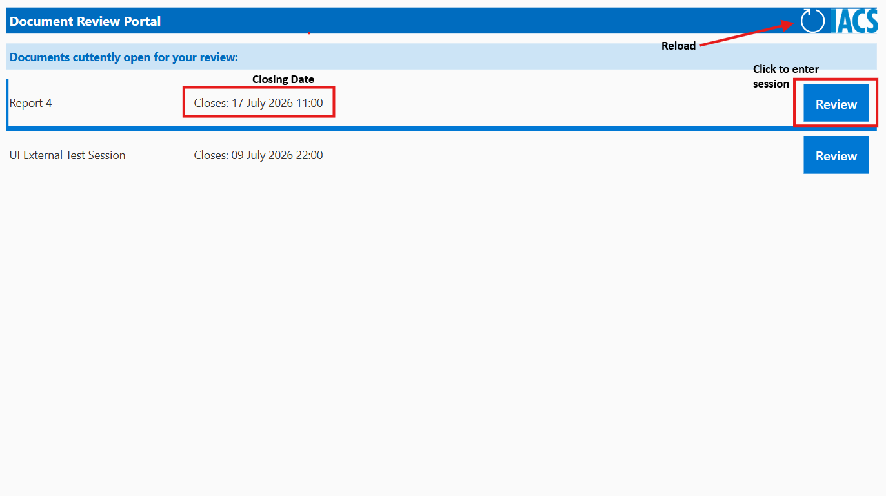

#### 2. Review Home

The Review Home page is the main access point for all available actions users can perform.

The following information are displayed in the consecutive order:

1. Session Title
2. Closing Date
3. Current Expression (if previously submitted)
4. Co-Sponsor Option (if previously submitted)

It consists of 5 buttons:

1. Navigate Back
2. Submit / Update My Expression
3. Add a Comment
4. View Comments
5. View Document

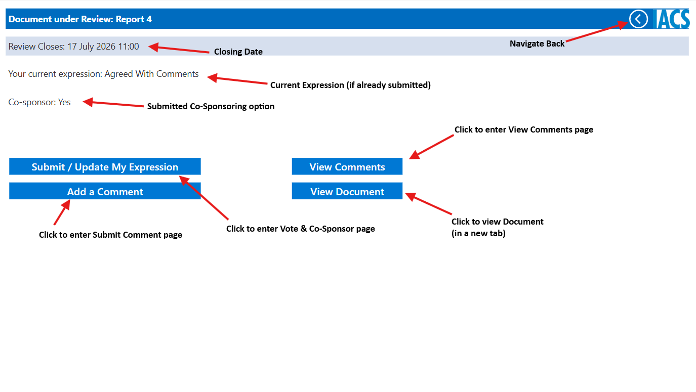

Button 1, Navigate Back will load the Active Reviews page.
Buttons 2 to 4 will load the page corelating to the selected action, while View Document will open the UI in a new tab in **Read-Only Mode**.

**The document under review should not be editable by default. If the document is editable, please notify it@iacs.org.uk immediately.**

#### 3. Submit Comment

New comments can be submitted only via the Submit Comments page.

The page contains a **rich text editor**, allowing various font and style text input. Highlighting, superscript/subscript, hyperlink, bullet/number List and other features are available.

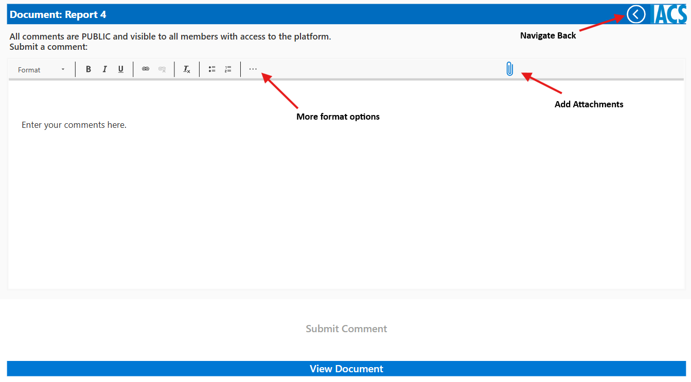

**Attachments** can be added to each comment. The recommended file type is .pdf however, any file type is accepted as an attachment.

Attachments without any comment text included are not acceptable. This function is meant to provide an option to attach **supporting material** and not replace entirely the comment section.

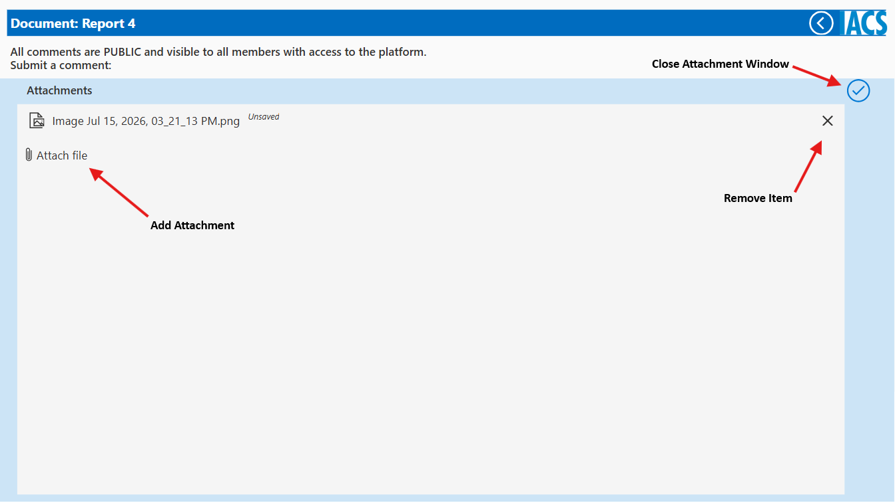

Empty or blank submissions are not allowed, and the *"Submit Comment"* button is deactivated until text is inputted in the required section.

The UI Document under review can be opened via the button at the bottom of the page *"View Document"*

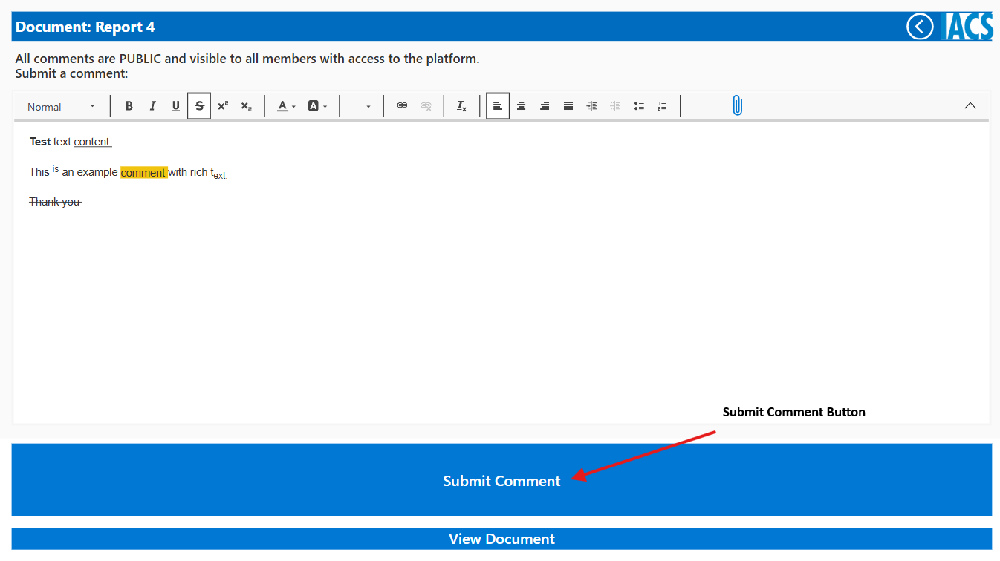

If a comment has been submitted successfully the following notification will appear.

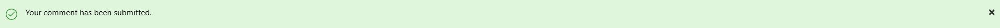

#### 4. Submit / Update My Expression

As Detailed in [2. Review Home](#2-review-home), if there is no expression submitted the Review Home Page will not have an expression saved, as per bellow image.

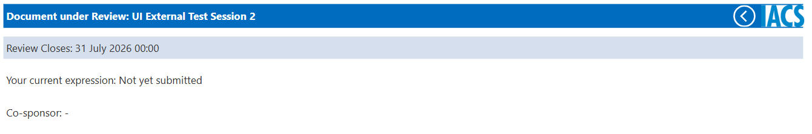

There are 3 options to select from:

1. Agreed
2. Agreed With Comments
3. Reject With Comments

Co-Sponsoring is available and is recorded along with the expression.

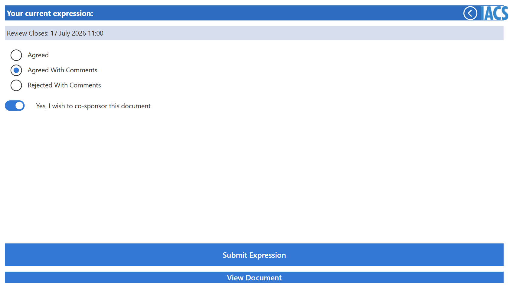

!!! note

    1. *"Agreed With Comments"* is only available if the user has submitted a comment previously. If there is no comment under the users name, the user will be notified that the submitted expression is shifted to *"Agreed"*.
    2. Co-Sponsor is available only when the selected expression is *"Agreed"* or *"Agreed With Comments"*.
    3. Any chance in previously submitted expressions is done exactly as the initial, including Co-Sponsoring changes.

If an expression has been submitted successfully the following notification will appear.

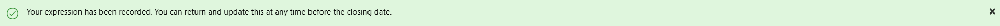

#### 5. View Comments

This section contains all previously submitted comments from members that have access to the platform.

The landing page contains a list of comments with a short preview. By clicking on any comment a new windows opens with the full text and attachments.

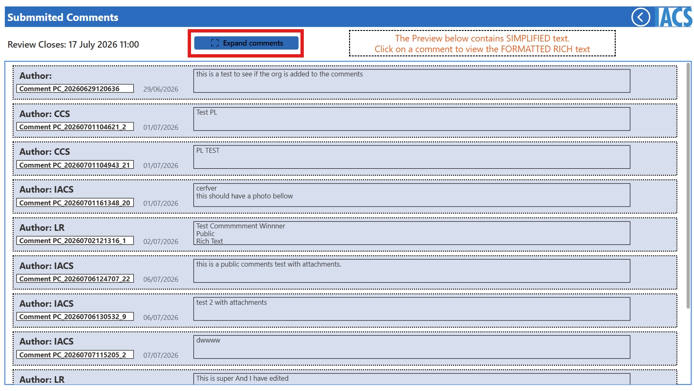

There is a button *"Expand Comments"* that changes the view from preview to full comment. This is to provide quick review of all the submitted comments.

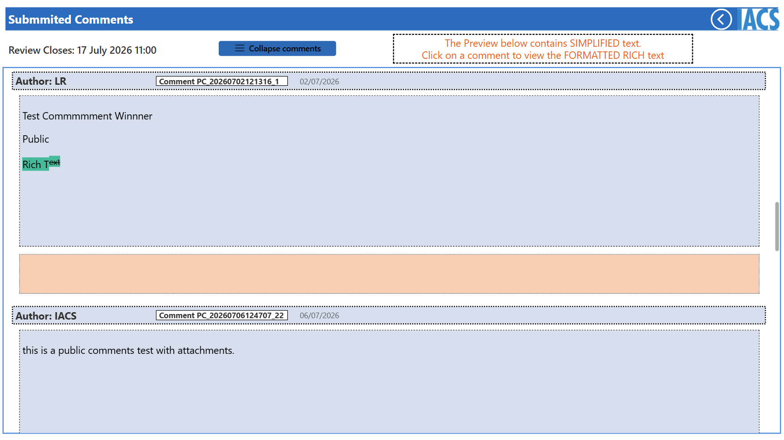

Comments submitted by the same user, have 2 buttons next to them allowing for editing and deletion.

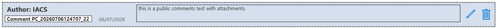

While editing, if Attachments have been updated, this needs to be saved **BEFORE** the comment changes.

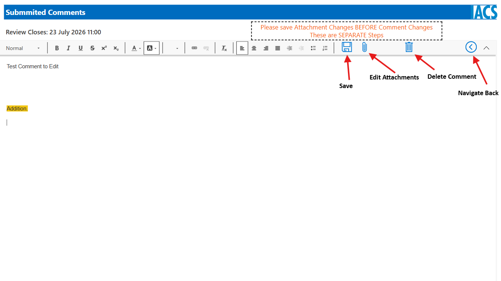

Attachments can be removed completely, replaced or added afterwards in a comment that was created by the same user.

After any change the save icon is required to be pressed for the system to store any changes.

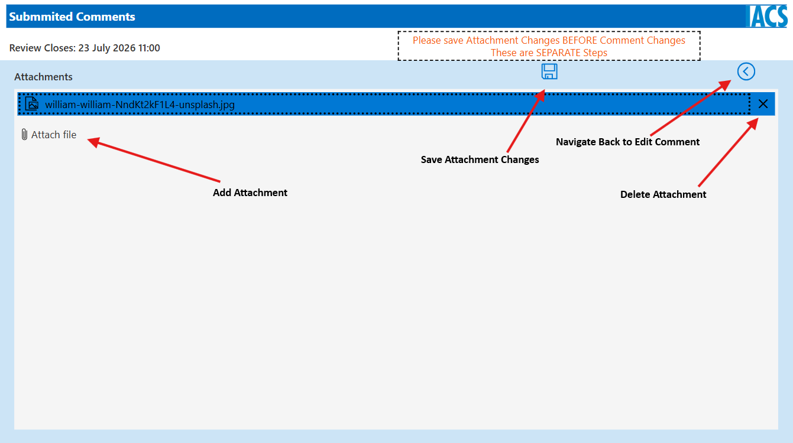

If changes were saved the Attachments window will automatically close and a notification window confirming the changes will appear at the top of the window.

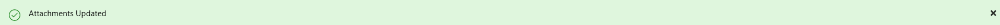

#### 6. View Document

The UI under review will be able to view via the app in read only form.

Throughout the platform, access to the document is available with a *"View Document"* being present in most pages.

If access to the word file is not possible, please contact:
it@iacs.org.uk

## Help

For any additional questions please contact it@iacs.org.uk.
